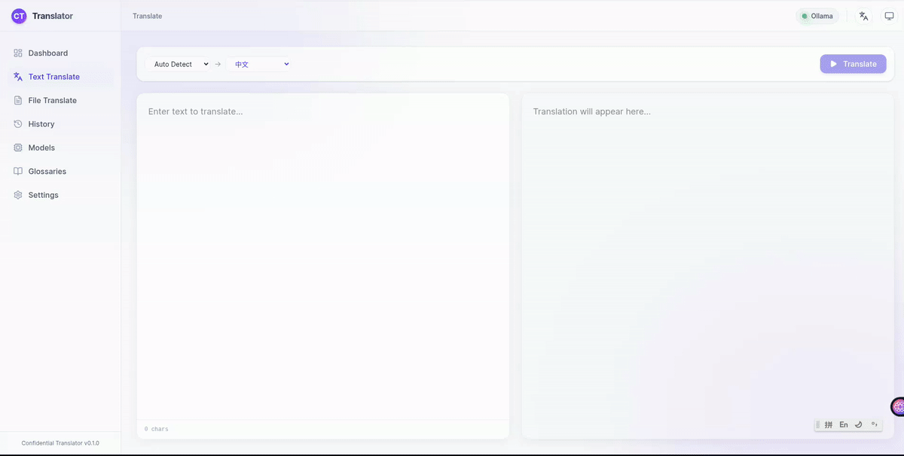

# Confidential Translator 🛡️

[](https://github.com/jajupmochi/confidential-translator/actions/workflows/ci.yml)
[](https://github.com/jajupmochi/confidential-translator/actions/workflows/docker-publish.yml)
[](https://jajupmochi.github.io/confidential-translator/)
[](https://opensource.org/licenses/MIT)

> [中文版 / Chinese README](./README_CN.md)

A **fully offline, privacy-first** document translation system powered by local Large Language Models via [Ollama](https://ollama.com). Your data never leaves your machine.

Built with **Python 3.12 (FastAPI)** + **Vue 3 (Vite + TailwindCSS v4)**, featuring a stunning glassmorphism interface with dark mode.

[](docs/docs/assets/demo.mp4)

## ✨ Features

| Feature | Description |
|---------|-------------|
| 🔒 **100% Offline & Secure** | Runs entirely on your machine — zero internet required |
| 🤖 **Local LLMs** | Uses Qwen 3 / 2.5 (or any Ollama model) for high-quality translations |
| 📄 **File Support** | PDF, DOCX, XLSX, CSV, Markdown, TXT, and Images (OCR) |
| 🌍 **Multi-Lingual** | English, Chinese, German, French + custom language input with AI validation |
| ⚡ **Real-time Streaming** | Watch translations appear token-by-token via SSE |
| 📊 **Dashboard & Analytics** | Translation history, timing metrics, tokens/sec reporting |
| 📖 **Glossary System** | Define domain-specific term mappings for consistent translations |
| 🎨 **Modern UI** | Glassmorphism design, dark mode, i18n (EN/ZH), responsive layout |
| 💾 **Native File Dialogs** | Cross-platform OS-native save/open dialogs (Linux/macOS/Windows) |
| 🐳 **Docker Ready** | One-command deployment with `docker compose up` |

## 🚀 Quick Start

### Docker (Recommended)

```bash
git clone https://github.com/jajupmochi/confidential-translator.git
cd confidential-translator
docker compose up -d
# Open http://localhost:8000
```

### From Source

```bash
git clone https://github.com/jajupmochi/confidential-translator.git
cd confidential-translator

# Build frontend
npm install -C frontend
npm run build -C frontend
cp -r frontend/dist/* backend/app/static/

# Run backend
cd backend && uv sync && uv run python -m app.main
```

### Standalone Binary

Download from the [Releases page](https://github.com/jajupmochi/confidential-translator/releases) — double-click and go!

## 🏗️ Architecture

```
┌──────────────────┐    REST + SSE    ┌──────────────────┐    Ollama API    ┌─────────────┐
│   Vue 3 Frontend │ ───────────────► │  FastAPI Backend  │ ──────────────► │  Local LLM   │
│   (Vite + TS)    │                  │  (Python 3.12)    │                 │  (Ollama)    │
└──────────────────┘                  └────────┬─────────┘                 └─────────────┘
                                               │
                                      ┌────────┴─────────┐
                                      │   SQLite + Files   │
                                      └──────────────────┘
```

## 🛠️ Tech Stack

- **Backend**: Python 3.12, FastAPI, SQLAlchemy (async), Pydantic v2, `uv`
- **Frontend**: Vue 3, Vite, TypeScript, Pinia, Vue Router, TailwindCSS v4, vue-i18n
- **File Processing**: PyMuPDF, Tesseract OCR, python-docx, openpyxl, pandas
- **Packaging**: Docker, PyInstaller, GitHub Actions CI/CD

## 📚 Documentation

Full documentation: **[jajupmochi.github.io/confidential-translator](https://jajupmochi.github.io/confidential-translator/)**

## 📄 License

MIT License. See [LICENSE](./LICENSE) for details.
