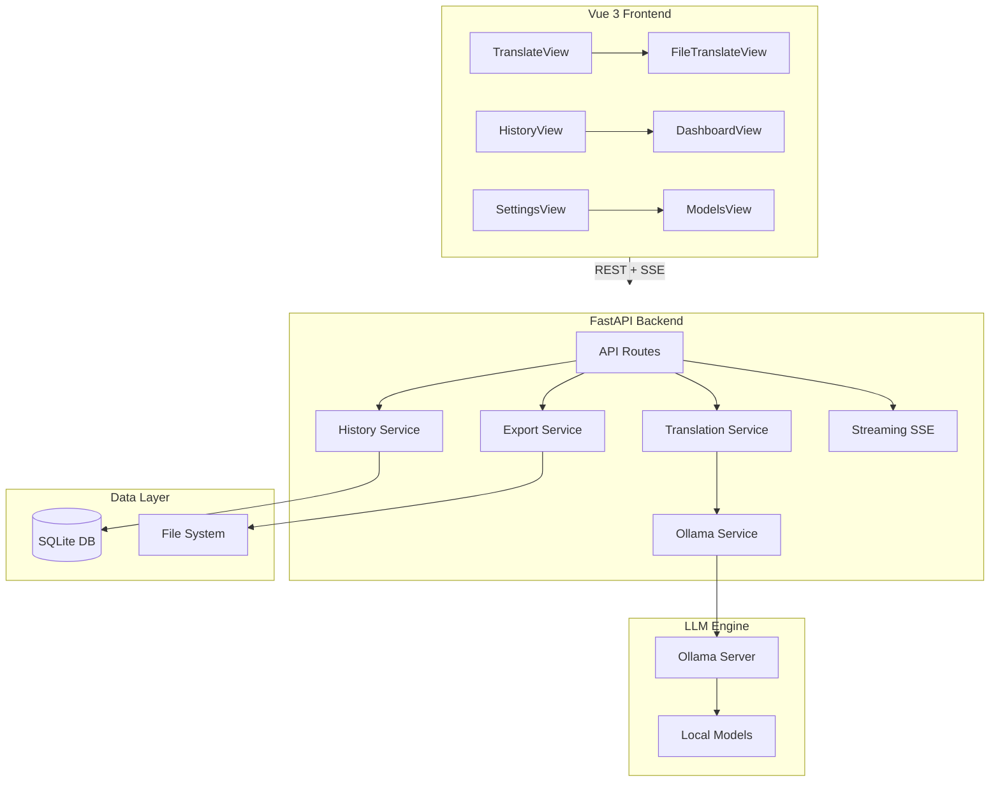

# Architecture

## System Overview

## Tech Stack

| Layer | Technology |
|-------|-----------|
| Frontend | Vue 3, Vite, TypeScript, Pinia, Vue Router, TailwindCSS v4, Lucide Icons, vue-i18n |
| Backend | Python 3.12, FastAPI, SQLAlchemy (async), Pydantic v2 |
| Database | SQLite via aiosqlite |
| LLM | Ollama (local inference) |
| File Processing | PyMuPDF, Tesseract OCR, python-docx, openpyxl, pandas |
| Packaging | PyInstaller, Docker, GitHub Actions |

## Key Design Decisions

- **SSE streaming** for real-time translation output (not WebSocket — simpler, one-directional)
- **SPA with middleware fallback** — FastAPI serves Vue app with a custom `SPAFallbackMiddleware` for client-side routing
- **Cross-platform native dialogs** — OS-specific file dialogs (kdialog, zenity, osascript, PowerShell) instead of heavy Qt/Electron dependencies
