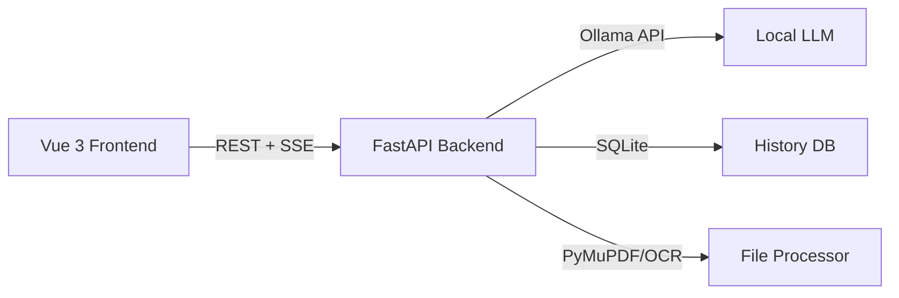

---
hide:
  - navigation
  - toc
---

# Confidential Translator

<div class="hero">
  <h1>🛡️ Your Offline, Privacy-First Translation Hub</h1>
  <p>Powered by local Large Language Models via Ollama. 100% secure — your data never leaves your machine.</p>
  <a href="getting-started/installation" class="md-button md-button--primary">Get Started →</a>
  <a href="https://github.com/jajupmochi/confidential-translator" class="md-button">View on GitHub</a>
</div>

<br>

<video controls autoplay loop muted playsinline width="100%">
  <source src="assets/demo.mp4" type="video/mp4">
</video>

## Why Confidential Translator?

Most translation services send your documents to external servers. **Confidential Translator runs entirely on your machine** — no internet required, no data leakage possible. Perfect for legal documents, medical records, financial reports, and any sensitive content.

## Core Features

<div class="grid cards" markdown>

-   :material-shield-lock:{ .lg .middle } **Total Privacy**

    ---

    Runs completely offline on your local machine. Your sensitive documents never leave your computer.

-   :material-brain:{ .lg .middle } **Local LLMs**

    ---

    Powered by state-of-the-art local models like Qwen 3 (via Ollama) for high-quality, nuanced translations.

-   :material-file-document-multiple:{ .lg .middle } **File Format Support**

    ---

    Translates PDF, Word, Markdown, Excel, CSV, and Images (OCR). Export back to the original format.

-   :material-translate:{ .lg .middle } **Multi-Lingual + Custom**

    ---

    Built-in support for English, Chinese, German, French — plus custom language input with AI validation.

-   :material-chart-bell-curve-cumulative:{ .lg .middle } **Dashboard & Analytics**

    ---

    Track translation history, processing speed (tokens/sec), and detailed per-translation reports.

-   :material-palette:{ .lg .middle } **Stunning Glassmorphism UI**

    ---

    Modern Vue 3 interface with fluid animations, dark mode, real-time streaming, and i18n support.

</div>

## Quick Start

=== "Docker (Recommended)"

    ```bash
    git clone https://github.com/jajupmochi/confidential-translator.git
    cd confidential-translator
    docker compose up -d
    # Open http://localhost:8000
    ```

=== "From Source"

    ```bash
    git clone https://github.com/jajupmochi/confidential-translator.git
    cd confidential-translator
    npm install -C frontend && npm run build -C frontend
    cp -r frontend/dist/* backend/app/static/
    cd backend && uv sync && uv run python -m app.main
    ```

=== "Standalone Binary"

    Download from [Releases](https://github.com/jajupmochi/confidential-translator/releases) and double-click!

## Architecture


